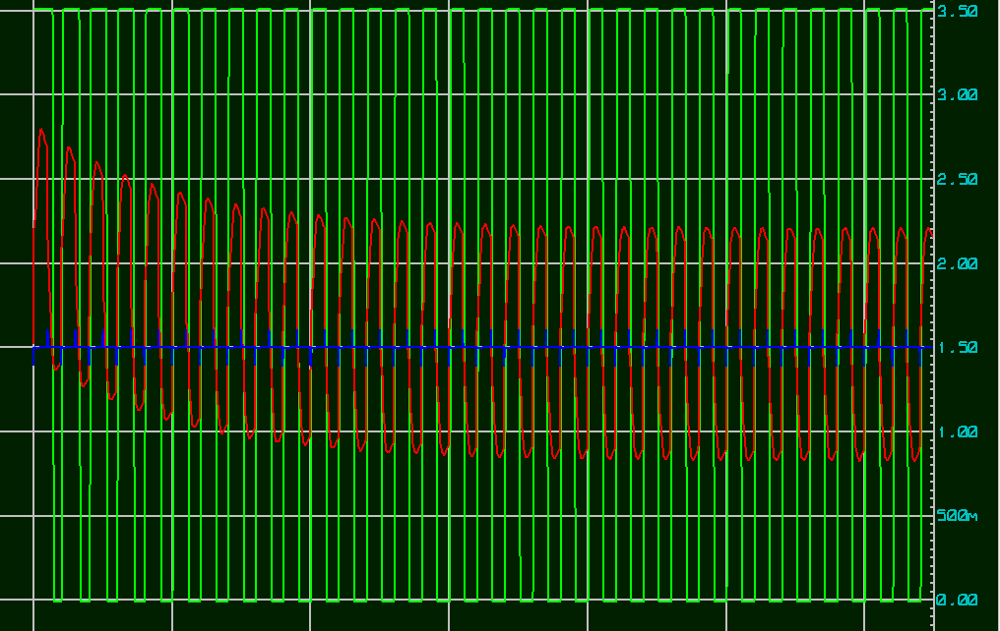

# Simulacion Panel Solar
## Fecha: 08/01/2026
## Objetivo
simular y analizar el comportamiento del panel solar como fotodetector, asi mismo simular el circuito Bias-T, en donde dividimos la informacion, y la respectiva informacion, con el fin de permitir que llegue de manera efectiva la informacion.

## Fundamento teorico
primero observamos que tenemos el principio de superposicion lineal, este es el corazon del bias tee y del sistema SWIPT , lo cual nos dice que puedes sumar un voltaje constante y una señal variable sin destruirse entre si, en donde el DC es nuestra energia, la segunda teoria es de impedancias, ya que al formar un inductor y capacitor para separar los caminos, el inductor en el DC, actua como un cable, dejando pasar la energia, y el capacitor actua como un muro, mientras que para el AC, actua como un freno (alta impedancia), y el capacitor actua como un puente (baja impedancia)

## Metodologia
1. se realizo el respectivo codigo en python para saber que valores poner en proteus

[Codigo Python](../modelo/Bias_T.py)

primero es importante ingresar las variables fundamentales, medidas anteriormente en otras simulaciones, como es la frecuencia y la corriente de la señal, y con esto hallamos la velocidad angular ya que los componentes reactivos responden a estos valores en rad/seg, usando la formula de w=2pi*frecuencia, con esto se sigue con el bloque del calculo de bias-tee (impedancia), usamos una impedancia del inductor muy alta como 3140 ohm, obteniendo de esta ecuacion ZL​=jωL=j2πfL  un valor de 100mH, hace que bloquee toda la señal AC y se comporte como un cable, mientras que una impedancia pequeña como 318 ohm capaz de obtener la señal AC y no DC, obtenemos un capacitor de 1x10^-7F, teniendo como resultado una un bloqueo de la señal DC por medio de esta formula  ZC​=1/2π⋅5000⋅1×10−7​≈318Ω
en el apartado obtenemos el amplificador TIA (Transimpedance amplifier), como se menciono teniamos una corriente de 2.7uA quiere decir que se desea obtener aproximadamente un voltaje de 1,27 para tener una señal grande y clara, y usamos la ley de ohm R =V/I, para obtener la resistencia del sistema de amplificacion obteniendo un valor comercial de 470k ohm, luego calculamos la velocidad del sistema, como tenemos un capacitor y una resistencia tenemos un filtro RC pasabajos controlando que tan rapido puede cambiar la señal, y el ruido de alta frecuencia se amplifica, con esto permite un sistema estable, en una regla de practica heuristica util, una onda cuadrada real tiene armonicos infinitos, por ello se debe tomar al menos 10 a 12 armonicos para una buena reconstruccion por esto usamos 50khz, del misma manera con esta ecuacion encontramos el condensador para no tener distorcion en nuestro filtro pasa bajo Cf​=1/2πRf​fc​​≈0.68pF, por lo cual usamos 1pF, por otro lado usamos el otro LM358 como comparador usamos un voltaje de 1.5 en el primero para que no se corte la señal, por lo cual ponemos un valor 0.02 V, asegurando que apenas la señal actue sobre 1.50V, el comparador se dispare inmediatamente el PWM digital

### Resultado 

en esta imagen se observa los valores mencionados en el enunciado anterior, que seran los indicados en el circuito en proteus

2. se realiza el circuito en Proteus
3. se hace un modelo electrico equivalente que representaria en este caso un panel solar

se evidencia que el I1 funciona como nuestros datos, en donde se comporta como nuestra señal pwm, esperada, ingresando un periodo de 200u y un DUTY de 100u (50%), ademas se agrega el rise time que nos dio el pwm del laser, 
el I2 representa la corriente modelada en el canal de enlace, el capacitor funciona como un panel solar en la vida real, ya que funciona como capacitancia de union ya que funciona como un diodo gigante como se habia mencionado anteriormente, entonces hasta que no se llene no puede continuar, o desea que el voltaje aumente de manera rapida por esto no permite comunicaciones de alta velocidad, y por su lado la resistencias representan perdidas que pueda tener el respectivo panel solar.

se evidencia el circuito Bias Tee, observamos el condensador y el inductor nombrado en el codigo, igualmente utilizamos una resistencia, y un capacitor, como representacion de consumir una alarma 

### Observacion 
se observa que la energia que entra para la lampara es minima, por esto cuando no se este comunicancdo solo funcionara como recolector de energia.

se analiza lo siguiente, este amplificador funciona tanto con un voltaje 12V a GND, como de 12V a -12V, si ponemos el pin 3 a tierra se observa que la señal se corta por esto se le da un voltaje de referenia llevando toda la señal a positivo siendo este 1.5 el 0 de la señal, permitiendo tener picos y su respectivo llano de manera periodica, energizamos con 5 v y gnd, y manejamos la resistencia 470k y el capacitor 1pF, (el circuito RC pasa bajo), la resistencia del pin out a el negativo genera una realimentacion negativa por esto la señal ingresa por el negativo, permitiendo que sea mas estable, permitiendo una amplificacion lineal y suave en lugar de un disparo loco, luego en la etapa de comparador energizamos de la misma forma, y utilizamos un voltaje de 1.52 V para la digitalizacion de la señal, apenas pasa el voltaje umbral se dispara la señal cuadrada, por esta razon la señal ingresa por el positivo porque se necesita ese disparo loco, despues de esta etapa ingresa de manera correcta al arduino

### Resultados

se observa como mientra pasa el tiempo la señal se estabiliza  ya que comienza en el valle casi en el voltaje de referencia

se observa como se comporta la señal de analogica a digital con un 2uty de 25%, osea 50U, se observa tambien una aleta de tiburon ya que el amp-opr, se demora en procesar generando un overshoot, como cuando se realizo la simulacion de PWM

Se observa un Duty 50%, 100U, sin embargo se ve una señal mas estable aunque la señal pwm sea algo demorada y se encuentre mas arriba del voltaje del amp, se observa una concordancia entre ciclos

se observa la inversa de 25 con una señal de subida mucho mas estable, pero en la caida, se encuentra mas overshoot, por capacitancia parasita

se observa una linea perfecta entregando el voltaje de manera constante

## Conclusion
la simulacion y el analisis teorico realizado permitieron validar satisfactoriamente el diseño de un sistema SWIPT (Simultaneous Wireless information and power transfer), basado en un panel solar, cumpliendo con el objetivo de caracterizar su comportamiento dual como recolector de energia, el sistema es viable para aplicaciones de baja frecuencia (5kHZ), donde el compromiso entre la recoleccion de energia y integridad de la señal de datos