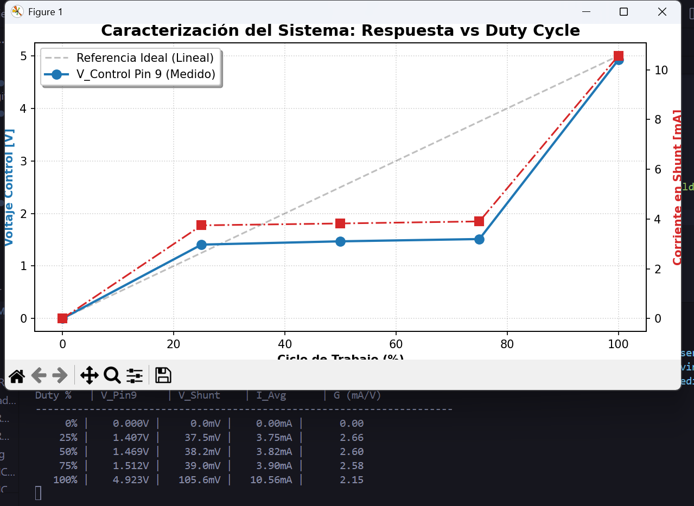

# Simulacion PWM_LASER

## Objetivo
se describe el funcionamiento del sistema Laser, en donde se pueda verificar, el funcionamiento de la modulacion PWM, permitiendo evidenciar el cambio de corriente proporcional a la potencia optica del laser, permitiendo asi la comunicacion FSO

## Fundamento teorico
el fundamento teorico se fundamenta en la modulacion PWM (modulacion por ancho de pulso), esta modulacion es una tecnica de modulacion digital utiizada para controlar, potenica, velocidad o intensisdad de una señal binaria, variando el tiempo durante la cual la señal permanece en estado alto (Ton) dentro de un periodo constante, el duty cycle, o el cliclo de trabajo esta dado por la relacion entre el tiempo en estado alto y el tiempo total, D=TON/T, este valor oscila entre 0, 1. mientras que su valor promedio de voltaje en el tiempo esta dado por Vavg =D*Vcc
el PWM es generado por el MCU, ya que cuenta con temporizadores internos, para controlar la emision de luz, se utiliza un transistor NPN, como interruptor electronico, alterando las regiones del corte replicando la señal del PWM, el led requiere un control preciso de corriente para evitar daños y garantizar una emision estable para evitar daños, por lo cual la corriente conduce de manera constante, esta corriente es generalmente proporcional a la potencia optica

## Metodologia

### Pasos
1. abrir un nuevo proyecto PWM_LASER en proteus 8
2. agregar Arduino UNO
3. agregar resistencia 1k, 10, 220
4. agregar Led
5. agregar transistor 2N2222
6. añadir GND, POWER

### Resultados

**Figura 1** como se evidencia en la figura 1 tenemos un arduino, uno el cual es el encargado de generar la señal PWM, luego sigue la señal a una resistencia de 1k, pasa al transistor el cual permite o no el paso de corriente, este es el 2N2222, hay una resistencia SHUNT usada para medir el voltaje de una manera indirecta, esto se mostrara mas adelante, led el cual simula el comportamiento del laser, resistencia para que no se queme el led

---

7. unir el codigo de Arduino con el simulador Proteus
8. realizar la simulacion, probar con cada duty

### Resultados

 
 
 **Figura 2** se evidencia que el led esta apagado

 
 **Figura 3** se evidencia que el led enciende con luz muy tenue

 
 **Figura 4** se evidencia que el led tiene la mitad de su brillo

 
 **Figura 5** se evidencia ya un led con luz claray fuerte

 
 **Figura 6** se obtiene el 100% del potencial del led

---

 9. se analiza el voltaje, para obtener resultados aproximados del sistema, esto se realiza en 3 puntos, en el MCU_PWM (Rojo), en la base del transistor (Verde), y el la resistencia Shunt (Nodo INPUT-AZUL, Nodo OUTPUT- AMARILLO) usando la grafica analogica y luego analizando el voltaje promedio por medio de python
-- para Duty de 0%

**Figura 7** como se observa el valor del voltaje es 0 quiere decir no genera una señal AC, como lo es PWM dando un valor de 0 v

-- para Duty de 25%

**Figura 8** en este caso se observa una señal cuadrada, en la Señal de color Rojose encuentran inversa ya que funciona como un Low-Side Switch, en el estado de saturacion del pin 9 en alto (quiere decir al aplicar 5V),el transistor se cierra y conecta el nodo del colector directamente a masa por esto hay una caida de voltaje aunque es el momento de maxima corriente en el pin 9, mientras que por otro lado el estado de corte cuando el pin 9 envia 0V, el transistor se abre y actua como un aislante y la corriente deja de fluir, permitiendo que el voltaje sube, hasta alcanzar el valor de la fuente de alimentacion.

el valor de la señal es de 106mV, mientras que para la señal del pin marca un Vpp de 4,92 pero se puede observar que su ancho de pulso no es tan grande 

-- para un Duty de 50%

en este caso se observa que es simetrico, el pulso pwm esta en su mitad del ciclo, mantiene sus mismos voltaje pico a pico

-- para un Duty de 75

se observa un ciclo mayor en On que en Off, mantienen su valor Vpp, expresando una mayor Duty

-- para un Duty de 100

se mantiene un voltaje constante a diferencia del Duty 0, este en pin 9 mantiene su voltaje de 5v

---

10. se analizan los datos de la grafica por medio de Python, permitiendo analizar el comportamiento y principalmente la corriente en la resistencia Shunt, para analizar y comprobar que la corriente tiene una directa correlacion con la potencia optica (Ya se comprobo en el circuito de manera fisica en proteus gracias al LED)

**Grafica 1**, como se logra evidenciar obtenemos 3 graficas la primera que pudimos obtener de las tablas suministrada por proteus es El voltaje del pin 9, PWM representada por el color azul, se evidencia que del Duty 25, al 75 no tiene un aumento lineal si no que rozan los mismos valores, deduciendo que hay un problema ya sea con el transistor, la manera en que se encuentra las resistencia Shunt o otras variables, como la comunicacion entre el arduino y el circuito, el osciloscopio o otras variables, esto pasa igual con la corriente de la resistencia shunt, y la linea punteada de gris plantea como se deberia el PWM ideal, esto quiere decir quee el sistema no es tan eficiente, leyendo simplemente el nivel duty 0 y 100 de manera correta

---

## Fecha: 29/12/2025

11. se busca una alternativa para realizar la modulacion PWM, para eso hacemos uso del transistor MOSFET IRLR7843, y realizamos el mismo circuito

**Figura 9**, hacemos uso de un MCU, el cual en su Pin 9 genera una Señal PWM, con una frecuencia de 5KHz esta fue modificada ya el est pin maneja aprox una frecuencia de 400 -500 hz, siendo muy lenta, esto se evidencia en el parpadeo de la led, por este motivo se uso una frecuencia de 5KHz, usamos una resistencia de 220 ohmnios, que permite limitar la carga del gate del MOSFET, este MOSFET actua como un interruptor rapido, en donde a diferencia del transistor BJT, conmuta muy rapido y mientras que el bjt tarda en apagarse, aparecen perdidas y retardos como se pudo observar en los puntos anteriores, del mismo modo se incorpora una resistencia de 10k entre la resistencia 220 y el gate del MOSFET, esta permite evacuar la carga residual capacitiva del gate, del mismo modo permite drenar la carga dada por el efecto miller, dada por la capacitancia entre gate y drain (cdg), esta al tener cambio rapidos on - off, hace que se le inyecte carga adiccional al gate, en la parte del source, se aterizza, mientras que por la parte del drain se incorpora el led (Laser), y su resistencia, a traves de las distintan pruebas se observo que en las graficas, se encontraba un pico de voltaje producida por la inductancia ya que al MOSFET a cambiar rapidamente, no dejaba que  la corriente cambie instantaneamente generando esta inductancia parasita, gracias a este capacitor snubber, permitio disipar la energia, amortiguar y matar la oscilacion ademas se añadio una resistencia en serie para no crear posibles oscilaciones, absorbiendo y dicipando (CIRCUITO RC)

[Codigo Arduino](../modelo/ARD__PWM_LASER/ARD__PWM_LASER.ino)
Como se evidencia establecemos el pin el cual va a realiza la señal PWM, e indicamos el nivel de Duty, se realiza el cambio de frecuencia, alargando el conteo que realiza internamente el MCU, por eso se le da un valor de 400, usando timers y prescaler

### Resultados

**Figura 10**, como se observa la señal verde (Drain), es una señal referente al comportamiento de un transistor que llega aprox a 4,50V pero presenta un overshoot hasta casi 5,50v el MOSFET soporta hasta 20V, pero esto no presenta la mejor linealidad en el sistema. este pico se incrementa mayoritariamente en 25 duty ya que esta muy poco tiempo encendido este fenomeno se le conoce como inductive switching transient

**Figura 11**, se añade entre Drain y Source un circuito RC para evitar este overshoot ya que la energia inductiva es disipada por la tierra del source

**Figura 12**, como se observa se ve un circuito mucho mas estable, sin el overshoot, aunque su voltaje es mejor ya que al momento de estar en funcionamiento el MOSFET, la corriente que fluye por el circuito RC se dirige al Source, no permitiendo que tenga el mismo comportamiento anteriormente expuesto, entre mas grande ea este capacitor, mayor voltaje absorvera, por eso se modifico a 10 nF, para obtener la mejor relacion potencia, linealidad, estabilidad

---

## Fecha:30/12/2025

12. realizamos una analisis de señal por medio de Python, en donde exportamos los datos presentados en Proteus

### Resultados

 primero se halla la frecuencia, para hallar esto, se realiza primero una digitalizacion ya que la señal real no es perfecta y tiene rampas y ruido para hallarlo es necesario usar la siguiente formula, Vin=Vmax+Vmin/2, cualquier valor encima de ese voltaje se considera un 1 y cualquier valor por debajo se considera 0, luego se detectan el trigger quiere decir el tiempo o el momento exacto en el que cambia exactamente la onda, por ejemplo si la señal pasa de 0 a 1 la resta es 1-0=0 quiere decir flanco de subida, mientras que si la señal pasa de 1 a 0 la resta es 0-1=-1 flanco de bajada, con esto calculamos el periodo, si los flancos de subida ocurrieron en t1 0,0, t2 0,2 t3 0,4, nos da como perodo 2, para finalizar le sacamos el promedio a todos estos periodos, y como en el proteus los datos estan en microsegundos, lo multiplicamos por 10e-6 para pasarlo a segundos y para nuestro caso es f=1/Tpromedio, siendo el resultado 5khz, teniendo un periodo de 200 us  f=1/200x10e-6s =5khz
 calculamos el Duty cycle, en donde ya uq econocemos la frecuencia debemos saber cuanto es el tiempo de encendido del pulso, como el periodo total, cuanto dura el ciclo completo tanto apagado y prendido, para ello necesitamos la siguiente formula, D=(Ton/Tperiodo)*100
 se mide el Ton, el codigo resta el tiempo donde la señal baja- menos el tiempo donde la señal subio, si el laser encendio en el us 0 y se apago en el 50us, el Ton es 50, el codigo del mismo modo permite que si hay 100 subidas, hallan 100 bajadas, entonces sacamos el promedio del Ton y usamos el Tpromedio anterior usado en la frecuencia para hallar el Duty, el Duty In (Arduino), nos da un resultado de 25,25% quiere decir que si esta representando el Duty 25, mientras que el Duty Out (Laser), es del 26,08% representando un 1,08% mas del real, porque el MOSFET, se demora mas en apagarse, pero de todas formas permite tener una buena fiabilidad de la transmision, si tenemos en cuenta que el periodo promedio es de 200, quiere decir que este 1.08 es 2,16 microsegundos de tiempo encendido de mas
 para el out, se observa que es una señal exponencial, n es cuadrada como la del pin 9, funciona de la misma manera ya que usamos un Threshold o un umbral de decision en este caso el metodo de cruce del 50%, quiere decir que apenas pase este limite logico
 medimos el error del ciclo de trabajo, nos quiere decir que tanto se deformo el pulso desde que salio del arduino hasta que llego al Laser, esta dado por Error DC=|DC ARDUINO- DC Laser|, quiere decir ERRORdc=|25,25%-26.06%|= 0,82% lo que explique anteriormente
 una de las medidas mas importantes es el rise time, esta es la medida que tan rapido una señal puede cambiar de un nivel bajo o alto, este tiempo se mide del 10 al 90% de su valor maxima por temas de ruido en los puntos mas bajos y altos, este rise time tiene extrecha relacion con el BandWidth, este, en la grafica 13, se observa que el rise time es de 1,3559us quiere decir que del 90% al 10% se demoro ese tiempo, su relacion es la siguiente BW=0,35/tr, entre menor sea el tr, mayor informacion puede transportar sin interferencia de simbolos (ISI), quiere decir que cuando el rise time es alto, quiere decir que el bit no alcanza a subir hasta que llegue otro bit, este bit no puede durar mas del 70% del rise time, en este caso BW es de 250kbps

 
**Figura 13**, se evidencia la grafica de como se comporta la señal tanto en el Drain, y el pin 9, ademas una tabla de resultado, ademas tenemos la grafica de rise Time para un duty 25

**Figura 14** se evidencia que el error DC es menor ya que al mantenerse mas tiempo en encendido, permite tener una señal mas estable por esto tampoco se observa un overshoot mayor

**figura 15** se evidencia el mismo principio de la figura 14, mientras que el rise time se mantiene casi igual para ambas figuras 

[Codigo Python](../resultados/Datos/Analisis.py)
por medio de este codigo permite hacer un estudio de datos, como fue los presentados por la base de dato de proteus, analizar e idializar el respectivo funcionamiento electrico del sistema presentado

## Conclusiones
se puede concluir que la alternativa mas optima para la ejecucion de un sitema para el control pwm, es la utilizacion de un MOSFET, ya que permite realizar cambios rapidos, y no presenta la misma inestabilidad que presenta un transistor BJT, ya que se satura y se demora demasiado en apagarse, como se logro observar en la primera prueba realizada, ademas se logro observar el ancho de banda ideal en el cual se podria ejecutar la transmision FSO. mas daelante cuando se realice la simulacion vamos a utilizar esta informacion para desarrollar de la manera mas coherente el actual proyecto